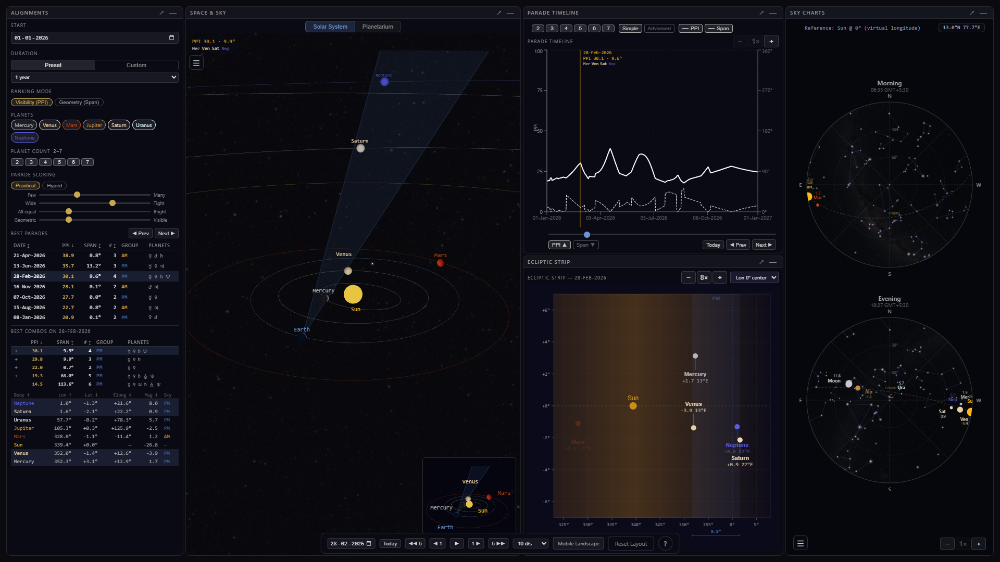
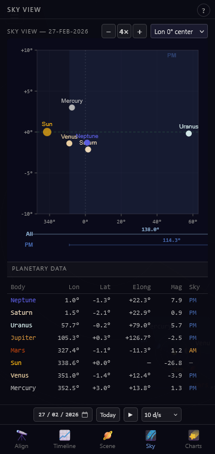
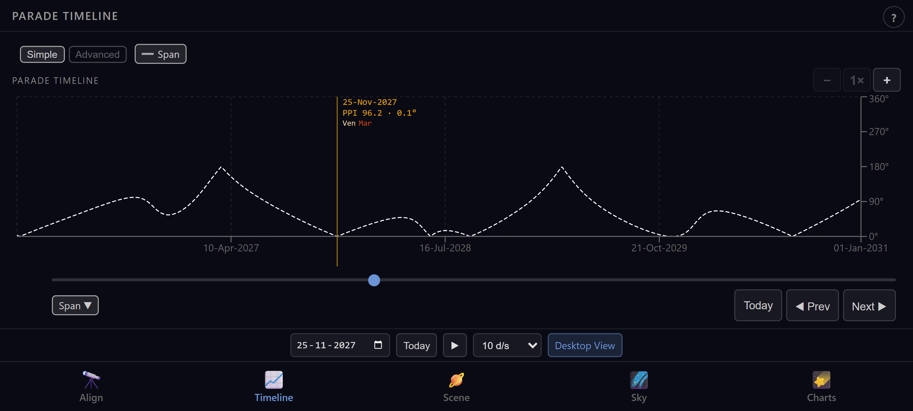

# Planet Parade

An interactive planetary alignment analyzer and sky visualization tool. Find the best dates to see multiple planets at once, visualize their positions in 3D, and explore the sky as seen from Earth — all in the browser.

**Live:** [kvsankar.github.io/planet-parade](https://kvsankar.github.io/planet-parade/) | [sankara.net/astro/planet-parade](https://sankara.net/astro/planet-parade/)

## Screenshots



<p align="center">
  
  &nbsp;&nbsp;
  
</p>

## Features

### 3D Solar System
- Heliocentric view of all planets (Mercury through Pluto) with accurate orbital positions
- Orbit lines, labels, and an inner-planets inset for detail
- Animated playback from 1x to 3650x speed across a 100-year range (1975–2075)

### Planetary Alignments
- Select any combination of planets and compute their angular separation over time
- Morning/evening visibility classification based on solar elongation
- Automatic detection of closest-alignment dates (local minima) with navigation
- Configurable time ranges from 3 months to 100 years

### Alignment Timeline
- Interactive time-series chart of planetary separation (total, morning, evening)
- Zoom and pan with mouse drag, Ctrl+wheel, or pinch gestures
- Click-to-navigate to any date; current-date indicator overlay
- Series toggles (All/AM/PM) and jump-to-minimum buttons (Today/Prev/Next)

### Sky View
- Scatter plot of planet positions in ecliptic longitude and latitude
- Centerable on ecliptic longitude 0° or the Sun
- Morning (AM) and evening (PM) visibility shading with span annotations showing angular extent
- Planetary data table with ecliptic longitude, latitude, elongation, visual magnitude, and AM/PM sky classification
- Draggable separator to resize chart vs table; table toggleable
- X-axis zoom/pan with pinch and drag support

### Stereographic Sky Charts
- Hemispheric projection of the sky dome at sunrise and sunset
- Sun, Moon (with phase), planets, 192 stars, 39 constellations, ecliptic curve, and Milky Way
- Visual magnitudes determine planet and star dot sizes
- Toggleable layers: stars, constellation edges, constellation labels, Milky Way, planets, Moon
- Panel-level zoom expands the charts while labels and dots retain their pixel sizes
- Smooth animation — sky rotates continuously as the date changes
- Mobile: AM/PM tabs to switch between morning and evening charts

### Cross-Platform
- Desktop: draggable, resizable floating panels with z-ordering
- Mobile: full-screen tabbed interface with compact controls
- Mobile landscape: two-column layouts for Align (controls | minima table) and Sky View (chart | data table); full-width sky chart circle
- Touch gestures throughout (pinch-to-zoom, drag-to-pan)
- Guided tour with Quick Tour and Full Tour modes; auto-starts on first visit

## Getting Started

```bash
npm install
npm run dev
```

Open http://localhost:5173 in your browser.

### Other Commands

```bash
npm run build        # Type-check and production build
npm run preview      # Preview the production build
npm run test         # Run unit tests
npm run test:watch   # Run tests in watch mode
```

## Tech Stack

| Layer | Technology |
|-------|-----------|
| UI Framework | React 18 + TypeScript |
| 3D Graphics | Three.js via @react-three/fiber and @react-three/drei |
| Charts | Recharts |
| Astronomy | astronomy-engine |
| Panel Layout | react-rnd (desktop), custom tab bar (mobile) |
| Onboarding | driver.js |
| Build | Vite |
| Tests | Vitest |

## Project Structure

```
src/
  components/
    scene/       3D solar system (Sun, planets, orbits, camera)
    panels/      Floating panel wrappers (AlignmentPanel, ChartPanel, SkyViewPanel, SkyChartPanel)
    alignment/   Charts, sky views, stereo sky charts, planet picker, minima table
    ui/          Playback bar, body selector, toggles, mobile tab bar, help button
  hooks/         State management, responsive hooks (useIsMobile, useIsLandscape),
                 guided tour (useTour), display settings, panel manager
  lib/           Astronomy calculations, alignment math, coordinate transforms
  data/          Star catalog, constellation lines, Milky Way polygons
  types.ts       Shared type definitions (CelestialBodyId, AlignmentDataPoint, etc.)
```

## Data Sources

- **Star catalog** — 192 stars from the Yale Bright Star Catalogue / Hipparcos (J2000 epoch), including 26 named stars and all stars to magnitude ~3.0
- **Constellations** — 39 constellation stick figures with line segments connecting catalog stars
- **Milky Way** — Multi-layer polygon data from the d3-celestial project, pre-transformed to J2000 equatorial coordinates
- **Planetary ephemerides** — Computed at runtime by astronomy-engine using VSOP87 and other high-precision models

## License

This project is licensed under the [MIT License](LICENSE).

## Acknowledgements

This project relies on the following open-source software:

- **[astronomy-engine](https://github.com/cosinekitty/astronomy)** — High-precision astronomical calculations by Don Cross
- **[Three.js](https://threejs.org/)** — 3D graphics library by mrdoob and contributors
- **[@react-three/fiber](https://github.com/pmndrs/react-three-fiber)** and **[@react-three/drei](https://github.com/pmndrs/drei)** — React bindings for Three.js by Poimandres
- **[Recharts](https://recharts.org/)** — Composable charting library for React
- **[react-rnd](https://github.com/bokuweb/react-rnd)** — Draggable and resizable component by bokuweb
- **[driver.js](https://driverjs.com/)** — Guided tour library by Kamran Ahmed
- **[d3-celestial](https://github.com/ofrohn/d3-celestial)** — Celestial map data including Milky Way polygons by Olaf Frohn
- **[Yale Bright Star Catalogue](http://tdc-www.harvard.edu/catalogs/bsc5.html)** — Stellar position and magnitude data
- **[Vite](https://vitejs.dev/)** — Frontend build tool
- **[Vitest](https://vitest.dev/)** — Unit testing framework
- **[React](https://react.dev/)** — UI library by Meta
- **[TypeScript](https://www.typescriptlang.org/)** — Typed JavaScript by Microsoft
